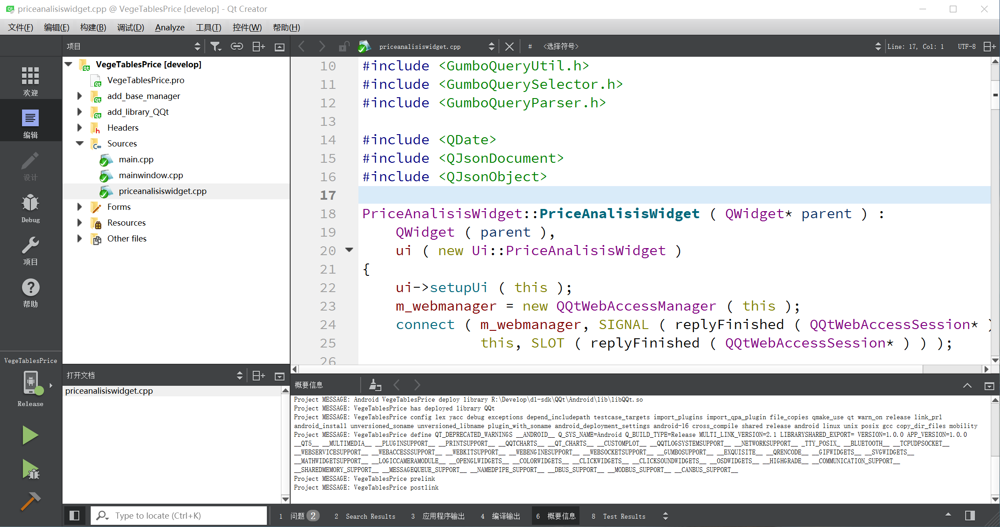

# Multi-link Technology

## 项目介绍  

为应用程序和链接库工程开发的，实现链接、发布依赖Library，发布SDK，发布应用，发布语言、配置等工程管理功能的多链接技术。  
Multi-link技术使用众多的pri进行函数定义，提供给用户丰富的App/Lib生产线操作函数，省却手动拷贝App、Lib、依赖令手痛的问题。  
我编写的Multi-link技术使用内置支持Library的方式支持众多的Library，方便共享对Library的支持，并且方便准确及时地同步到工程中进行使用，基本上编写一次，便不必再修改。  
用户有使用方便的Library可以给我发邮件，tianduanrui@163.com.把add_library_XXX.pri发给我。我会把它提交到Multi-link工程里。  
Multi-link技术位于全自动化构建技术的最关键的位置，即源代码工程全自动化构建、生产。

## 功能清单  

1. 跨windows、macOS、linux(笔者使用ubuntu kylin x64)三个平台，功能已经全面完成。
2. 这些功能，就是在qmake阶段设置好所有的用户过去需要手动做的工作，通过QMAKE_POST_LINK自动完成。
3. add_function.pri add_project.pri里面提供了丰富的基本功能，用户可以用其扩展技术外功能。
4. add_deploy() 发布app到app发布目录 用于app工程。
5. add_sdk() 发布sdk到sdk目录 用于library工程。
6. add_dependent_manager() 为工程添加依赖的SDK，它会到SDK目录查找具体的SDK，输入参数，sdk包名，sdk包内子模块名。比如：Qt, Widgets.这里吆告诉读者，把Qt SDK放到SDK目录里也有效果。通常这一个函数链接库的SDK就够用了，里面包含了add_include() 包含头文件路径 add_library() 链接库 add_defines() 添加library的宏定义 add_deploy_library() 把库跟随app发布到app发布目录。
7. add_deploy_config() 将指定路径的配置文件发布到build路径和product发布路径。
8. add_icons() 为应用程序添加logo，尤其windows和macOS下。
9. add_language() 为应用程序添加翻译文件，自动添加翻译文件，用户只需要找到文件翻译下就可以了。
1. add_version() 为应用程序添加版本信息。

## 提供的工具  

经过发布的App直接点击就可以运行，*大的省去了用户手动发布App的劳烦过程。  
*Multi-link提供ProductExecTool，可以对产品集中查看、调用运行。*  
*Multi-link提供AddLibraryTool，方便用户通过准备好的SDK自动生成add_library_xxx.pri链接环。*    
*Multi-link提供AddLibraryTool-Multiple，可以同时对多套SDK进行生成链接环。*  
*Multi-link提供Multi-linkConfigTool，方便用户配置Multi-link v2必需的三大路径，build/sdk/deploy root。*  
*Multi-link提供SdkListTool，方便用户查看已经准备好的SDK在各个平台准备情况的表格。*  

## 软件架构  

[多链接技术的工程结构.xlsx](Multi-linkFunctionList.xlsx)  
由于Qt第四代编译比较困难，Qt4内置的qmake版本2.01a版本太低，对函数的支持不足，对嵌套函数的支持也不足，  
所以，Multi-link2.0不支持Qt4。  
Multi-link1.0绑定QQt，也不会继续开发与QQt脱离的纯粹使用pri的版本，Qt4 qmake版本太低，不便于开发。      

## 安装教程

1. 在用户主目录/.qmake/app_configure.pri里面配置三个变量(Only Once)  
    - LIB_SDK_ROOT = /home/abel/Develop/b1-sdk
    - APP_BUILD_ROOT = /home/abel/Develop/c0-buildstation
    - APP_DEPLOY_ROOT = /home/abel/Develop/b0-product
    - 可以编译运行Multi-linkConfigTool，实现一次图形化的配置，配置好了还会兼容Multi-link 1.0.
    - 配置一次就可以了，Multi-link提供的其他工具就都可以用了。  
2. 在project build configure页面配置构建环境变量，QSYS=Windows等指示平台变量（参见add_platform.pri）。
    - 这个是每次每个build都需要配置的，这个有Qt Creator的开发历史原因。  

## 使用说明

1. 一个可以拷贝multi-link到自己工程目录，
    - 一个可以clone multi-link到公共位置
    - 一个可以clone multi-link到工程目录作为submodule。这个是推荐方式，我对链接库们的支持容易使用到自己的工程里，我一般使用这个方式。
2. include (.../multi-link/add_base_manager.pri)  
4. add_version() add_deploy() add_dependent_manager(QQt) add_dependent_manager(XXXLib) ...
5. 如果希望添加自定义模块，如果希望添加自己使用的其他的app-lib没支持的库，
    - 那么从multi-link/app-lib里拷贝add_custom_manager.pri到工程目录（optional，Multi-link 1.0）。   
    - 使用AddLibraryTool写自定义的add_library_XXX.pri（Multi-link 2.0），然后拷贝这个pri到工程目录，或者到Multi-link的app-lib目录，使用add_custom_dependent_manager(XXX)/add_dependent_manager(XXX)调用.   

[详细使用说明](usage.md)  

## 使用截图  
一边编辑App源代码，一边编辑依赖库源代码，却不用管理任何应用和库的位置。   

编辑App的源代码。    
  
编辑依赖库的源代码。    
  
  
却不用管理库和软件的位置。    
   
   
    
不经过手搬运软件，Multi-link技术帮助用户自动获得可以点击运行的产品。  
    
使App开发者真正成为一名码工，而不是软件（链接库）搬运工。     

## 约束  

1. 源代码目录里multi-link目录有必要和代码目录平级。不应当把multi-link文件夹放到src目录里。  
2. macOS下，一切被依赖的Library不可以和依赖者App或者Library共同编译。免于触发first-time bug。 
    - 已经修复。修改了搬运软件的时机。   
    
## 联系我  
邮箱： tianduarnui@163.com  
QQ: 2657635903  
