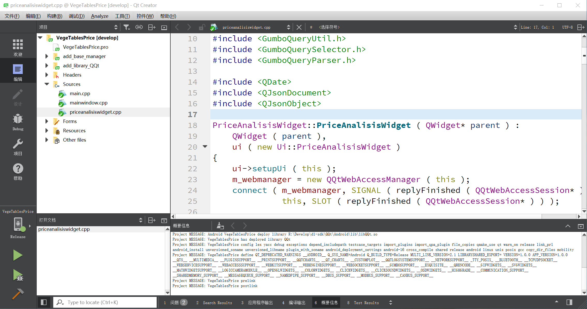
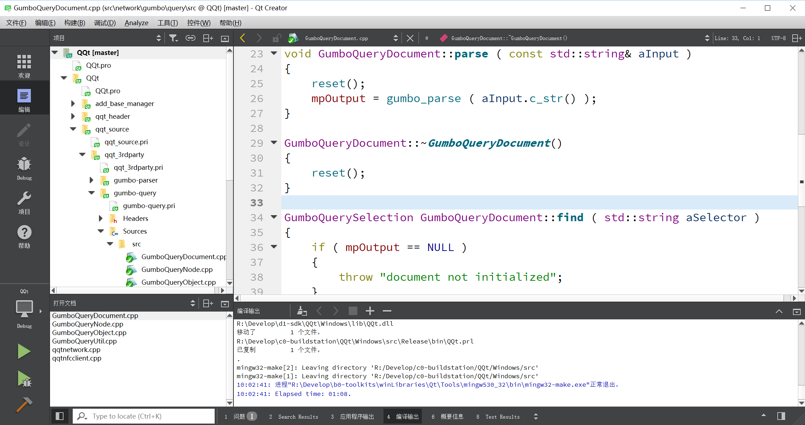
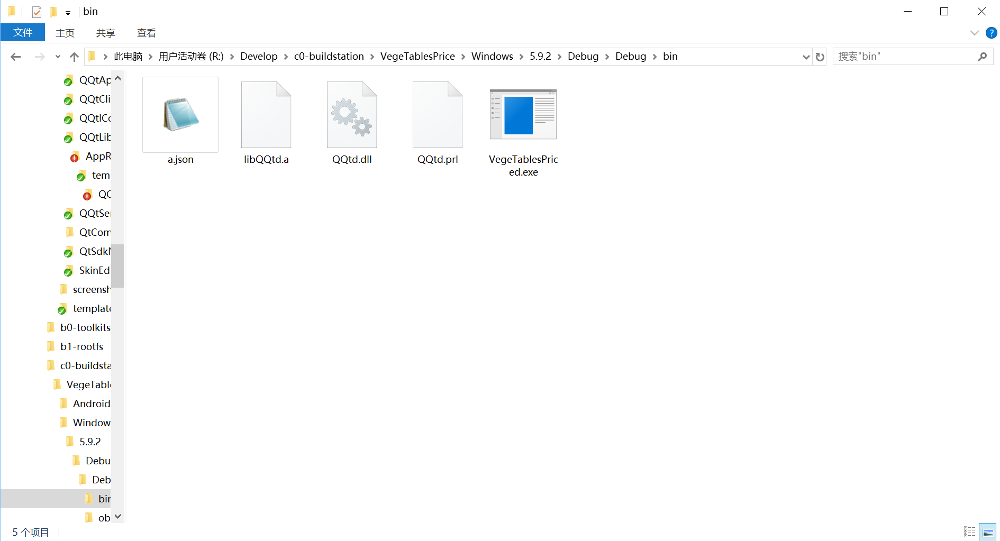
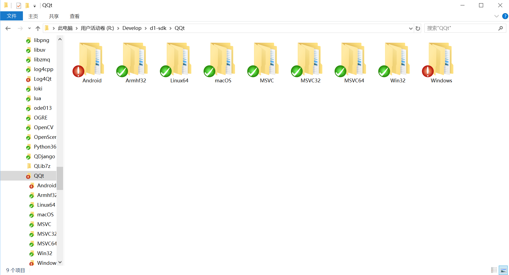
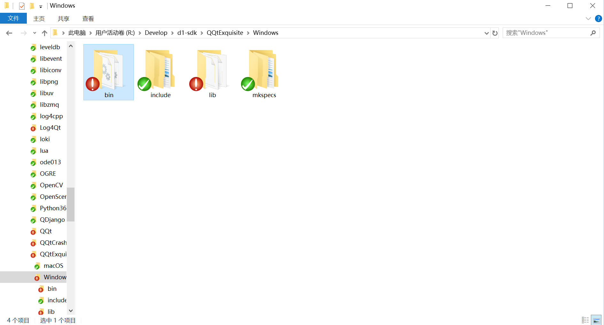
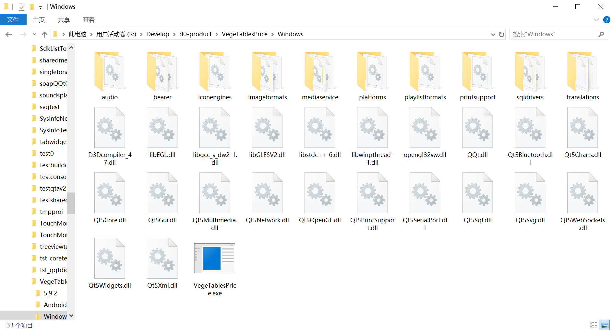

# 屏幕截图  

一边编辑App源代码，一边编辑依赖库源代码，却不用管理任何应用和库的位置。   

编辑App的源代码。    
  
编辑依赖库的源代码。    
  
  
却不用管理库和软件的位置。    
   
   
    
不经过手搬运软件，Multi-link技术帮助用户自动获得可以点击运行的产品。  
    
使App开发者真正成为一名码工，而不是软件（链接库）搬运工。     

[返回](.)
