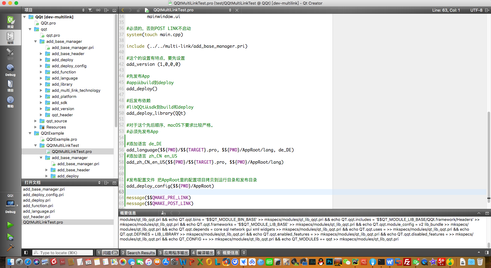
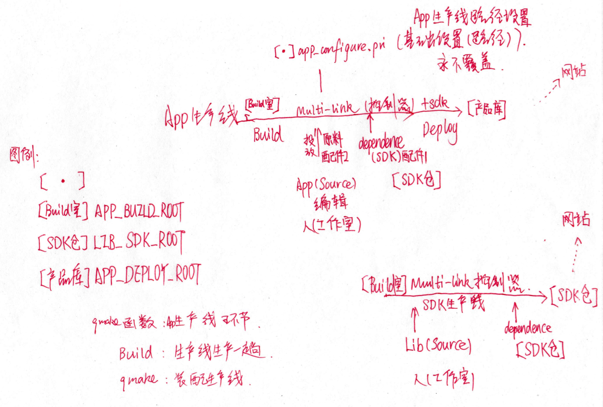
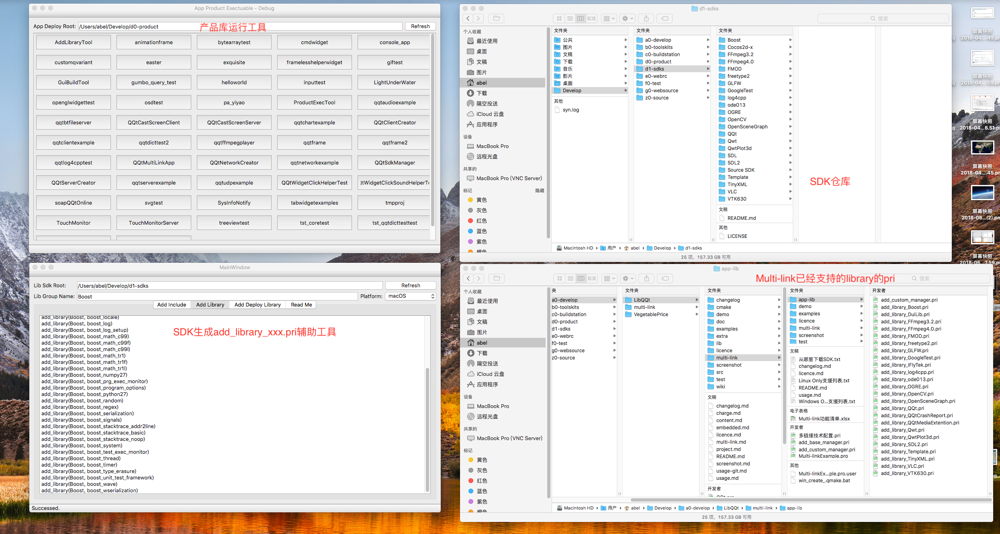
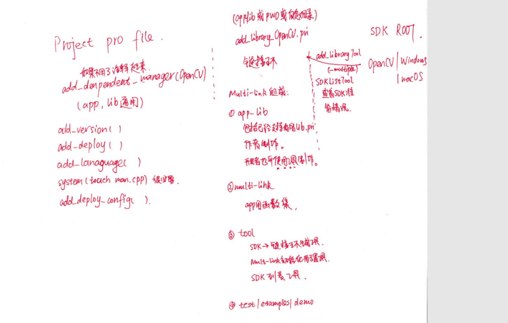
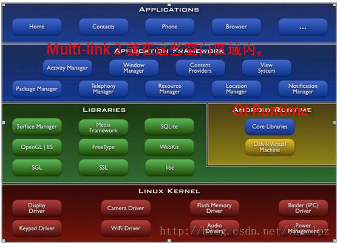

# Multi-link v1.0  
v1.0仅仅支持链接LibQQt，并且依附在LibQQt代码中。  

# Multi-link v2.0    

在完成的Multi-link技术里，新的QSYS环境变量和Qt Kit的关系  
QKIT不再使用，而仅仅使用QSYS。  

| Qt Kit | Kit File System Name | QKIT | QSYS |   
| ---- | ---- | :---- | :---- |  
| Windows 32bit | Windows | - | Windows |  
| Windows 32bit | Win32 | - | Win32 |  
| Windows 64bit | Win64 | - | Win64 |  
| Linux 32bit | Linux | - | Linux |  
| Linux 64bit | Linux64 | - | Linux64 |  
| macOS clang 64bit | macOS | - | macOS |  
| Arm 32bit | Arm32 | - | Arm32 |  
| ArmHF 32bit | Armhf32 | - | Armhf32 |
| Mips 32bit | Mips32 | - | Mips32 |
| Embedded 32bit | Embedded | - | Embedded |  
| iOS clang | iOS | - | iOS |  
| iOS Simulator |iOSSimulator | - | iOSSimulator |  
| Android armeabi |Android | - |Android |  
| Android x86 |AndroidX86 | - |AndroidX86 |  

####使用场景截图  

  

####Multi-link技术能够达到的管理能力   
App和Lib的源代码，一直处于编写之中。  
App和Lib的目标，一直从Build位置，持续发布到Deploy位置和SDK位置。  
用户再也不必为了管理生成目标、发布目标和链接而劳费手劲。  
在2008年的时候还没有这个技术，2018年，这个技术终于变成了现实。  
现在，按照GPL发布，  
基于qmake。  

  

####多链接技术创造的生产线  
Multi-link会一直处于App/Lib生产线的控制器地位。   
Multi-link允许用户自行添加任何依赖项，我把一些常用的依赖项添加用pri放在了app-lib里，
而这些依赖项的SDK我保存在了百度网盘，以方便用户取用，用户只需要下载下来解压到自己的LIB_SDK_ROOT里。  
百度网盘地址链接：https://pan.baidu.com/s/1FPPkTUnk2XBL4rpnZsAGmw 密码：hotz    
SDK难免有不全，难免不能满足任何用户的需求，请用户自行补齐。 
利用Multi-link技术的添加Library模板很容易的。 
  

####多链接技术使用注意  
1. Multi-link 2.0已经不强调 build的编译路径设置。
2. 也不强调对Qt Creator FileSystemName的设置。也就是不要求用户按照过去的要求设置Creator的默认编译路径。
3. Multi-link可以独立于任何Library App工程使用，建议作为submodule使用，能够可靠保证移植性。
4. 但是QSYS_STD_DIR还是有用的，输出SDK和DeployAPP的时候使用。并且，QAPP_STD_DIR和这个SDK的路径还不一样，App发布用的有个Debug和Release的区分，SDK的没有（区分），在一起。

####多链接技术已经支持的Library  
并且多链接技术已经提供了产品运行器和SDK链接文件编写辅助工具。  
对Library的支持会持续更新。  
用户也可以把使用的方便的add_library_xxx.pri发送给我到tianduanrui@163.com，我会把它加入app-lib族。  

  

# Multi-link v2.1    

- v2.1默认不再链接QQt。  
- 建议用户把multi-link作为子模块clone下来。  
- 用户在include(multi-link/add_base_manager.pri)以后，  
    - add_dependent_manager(QQt) 就完成了链接、跟随发布QQt。（内部自动判断Proj类型，App Proj才会发布，Lib Proj不会发布。）    
    - add_custom_dependent_manager(xxx)是在自定义目录加载add_library_xxx.pri，默认工程当前目录。  
    - add_create_dependent_manager(xxx)是在自定义目录加载add_library_xxx.pri，不存在则使用模板创建这个pri，默认app-lib目录。  
- add_deploy() 或者 add_sdk()(Lib Proj) 是标准使用函数，任何工程都用他。
- add_version() 添加版本。  
- add_lanauage() 添加语言。  
- 给用户提供了AddLibTool用于辅助用户从SDKROOT直接获取add_library_xxx.pri文件。  
- ProductExecTool用于帮助用户从产品库里运行程序，程序太多的时候，一个一个深入目录点击运行也是比较不容易。    

# 多链接技术使用说明   

看懂了v2的设计思路、原理以后，看看这里的多链接技术使用说明。  

  

# Multi-link v2在操作系统中的地位  

在操作系统里Multi-link的地位如下，用户说这是嵌入式操作系统的结构，其实这也是桌面操作系统的结构。  
Multi-link 2主要应用于App和App Framework层的多关系链接工作。
在这种二进制不兼容的多种多样的系统当中，这种链接方式非常有用。     
在Library层，通常比较现代的工程管理工具为CMake，而在App层比较流行的工程管理工具为qmake，跟随Qt发布的qmake。  

    

[返回](.)  
