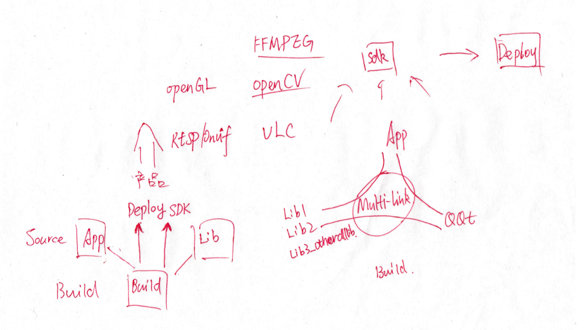
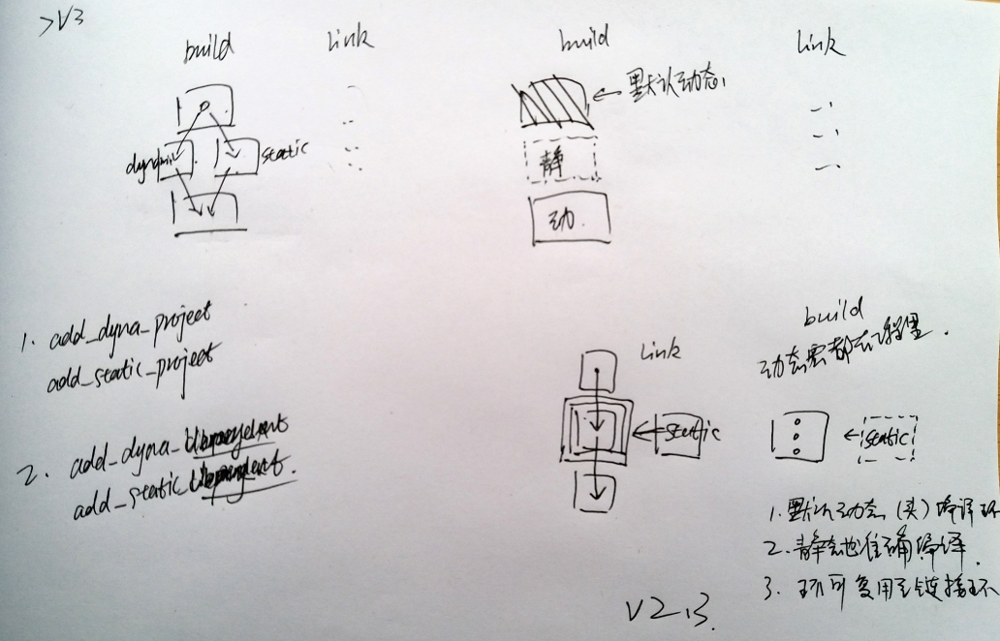
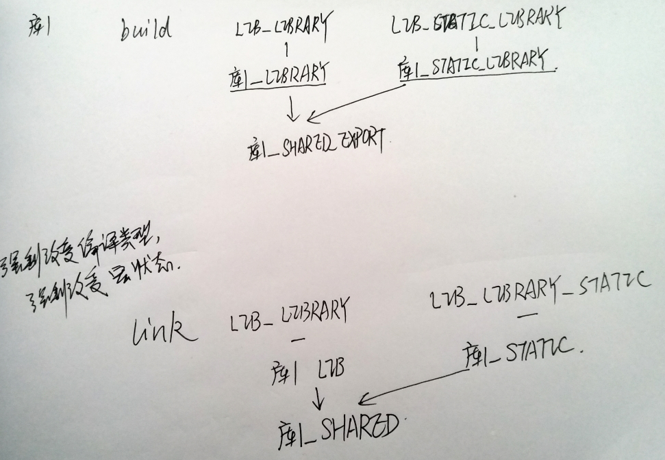

# Multi-link v1.0  
v1.0仅仅支持链接LibQQt，并且依附在LibQQt代码中。  

- Qt Creator设置默认编译目录：  
%{JS: Util.asciify("/your/local/path/to/build/root/%{CurrentProject:Name}/%{CurrentKit:FileSystemName}/%{Qt:Version}/%{CurrentBuild:Name}")}

# Multi-link v2.0    

在完成的Multi-link技术里，新的QSYS环境变量和Qt Kit的关系  
QKIT不再使用，而仅仅使用QSYS。  

| Qt Kit | Kit File System Name | QKIT | QSYS |   
| ---- | ---- | :---- | :---- |  
| Windows 32bit | Windows | - | Windows |  
| Windows 32bit | Win32 | - | Win32 |  
| Windows 64bit | Win64 | - | Win64 |  
| Linux 32bit | Linux | - | Linux |  
| Linux 64bit | Linux64 | - | Linux64 |  
| macOS clang 64bit | macOS | - | macOS |  
| Arm 32bit | Arm32 | - | Arm32 |  
| ArmHF 32bit | Armhf32 | - | Armhf32 |
| Mips 32bit | Mips32 | - | Mips32 |
| Embedded 32bit | Embedded | - | Embedded |  
| iOS clang | iOS | - | iOS |  
| iOS Simulator |iOSSimulator | - | iOSSimulator |  
| Android armeabi |Android | - |Android |  
| Android x86 |AndroidX86 | - |AndroidX86 |  

#### 使用场景截图   

  

#### Multi-link技术能够达到的管理能力   
App和Lib的源代码，一直处于编写之中。  
App和Lib的目标，一直从Build位置，持续发布到Deploy位置和SDK位置。  
用户再也不必为了管理生成目标、发布目标和链接而劳费手劲。  
在2008年的时候还没有这个技术，2018年，这个技术终于变成了现实。  
现在，按照GPL发布，  
基于qmake。  
  

#### 多链接技术创造的生产线   
Multi-link会一直处于App/Lib生产线的控制器地位。   
Multi-link允许用户自行添加任何依赖项，我把一些常用的依赖项添加用pri放在了app-lib里，
而这些依赖项的SDK我保存在了百度网盘，以方便用户取用，用户只需要下载下来解压到自己的LIB_SDK_ROOT里。  
百度网盘地址链接：https://pan.baidu.com/s/1FPPkTUnk2XBL4rpnZsAGmw 密码：hotz    
SDK难免有不全，难免不能满足任何用户的需求，请用户自行补齐。 
利用Multi-link技术的添加Library模板很容易的。 
  

#### 多链接技术使用注意   
1. Multi-link 2.0已经不强调 build的编译路径设置。
2. 也不强调对Qt Creator FileSystemName的设置。也就是不要求用户按照过去的要求设置Creator的默认编译路径。
3. Multi-link可以独立于任何Library App工程使用，建议作为submodule使用，能够可靠保证移植性。
4. 但是QSYS_STD_DIR还是有用的，输出SDK和DeployAPP的时候使用。并且，QAPP_STD_DIR和这个SDK的路径还不一样，App发布用的有个Debug和Release的区分，SDK的没有（区分），在一起。

#### 多链接技术已经支持的Library   
并且多链接技术已经提供了产品运行器和SDK链接文件编写辅助工具。  
对Library的支持会持续更新。  
用户也可以把使用的方便的add_library_xxx.pri发送给我到tianduanrui@163.com，我会把它加入app-lib族。  
  

#### 多链接技术配置工具   
  

# Multi-link v2.1    

- v2.1默认不再链接QQt。  
- 建议用户把multi-link作为子模块clone下来。  
- 用户在include(multi-link/add_base_manager.pri)以后，  
    - add_dependent_manager(QQt) 就完成了链接、跟随发布QQt。（内部自动判断Proj类型，App Proj才会发布，Lib Proj不会发布。）    
    - add_custom_dependent_manager(xxx)是在自定义目录加载add_library_xxx.pri，默认工程当前目录。  
    - add_create_dependent_manager(xxx)是在自定义目录加载add_library_xxx.pri，不存在则使用模板创建这个pri，默认app-lib目录。  
- add_deploy() 或者 add_sdk()(Lib Proj) 是标准使用函数，任何工程都用他。
- add_version() 添加版本。  
- add_lanauage() 添加语言。  
- 给用户提供了AddLibTool用于辅助用户从SDKROOT直接获取add_library_xxx.pri文件。  
- ProductExecTool用于帮助用户从产品库里运行程序，程序太多的时候，一个一个深入目录点击运行也是比较不容易。    

# 多链接技术使用说明   

看懂了v2的设计思路、原理以后，看看这里的多链接技术使用说明。  

  

# Multi-link v2在操作系统中的地位  

在操作系统里Multi-link的地位如下，用户说这是嵌入式操作系统的结构，其实这也是桌面操作系统的结构。  
Multi-link 2主要应用于App和App Framework层的多关系链接工作。
在这种二进制不兼容的多种多样的系统当中，这种链接方式非常有用。     
在Library层，通常比较现代的工程管理工具为CMake，而在App层比较流行的工程管理工具为qmake，跟随Qt发布的qmake。  

    

# Multi-link v2.3    

Multi-link v2.3又增加了新特性，即新的函数。  

##针对链接库1进行编译和链接  

|链接库1|动态|静态|  
|-----|------|-------|  
|编译库1|add_dynamic_library_project()|add_static_library_project()|
|链接库1|add_dependent_manager(LibGroup1Name)|add_static_dependent_manager(LibGroup1Name)|

1. 编译时
    - add_dynamic_library_project()
    - add_static_library_project()
    - 这两个函数可以强制改变工程动态、静态编译，默认是动态编译的。  
2. 链接时
    - add_dependent_manager(Lib1-Name)
    - add_static_dependent_manager(Lib1-Name)
    - 这两个函数可以强制改变库1的动态、静态链接，当然编译时必须配合。  

##针对链接库1的导出宏的设置  

|链接库1|动态|静态|  
|-----|------|-------|  
|编译库1|add_library_export_macro()|add_library_export_macro()|
|链接库1|add_library_export_macro()|add_library_export_macro()|

Multi-link v2.3使用一个函数，为用户提供API导出宏（可选）。  
- API导出宏被库1的自有动态宏、自有静态宏控制。  
    - 链接库1，编译时，这个函数可以帮助用户省略global.h源文件。
    - 链接库1，链接时，如果库1没有global.h文件，在链接环的add_defines函数里使用这个函数，可以帮助用户控制库1的符号导出。 

##链接库1在编译和链接时的导出宏状态  

|链接库1|动态|静态|  
|-----|------|-------|  
|编译库1|导出宏为EXPORT|导出宏为空值|
|链接库1|导出宏为IMPORT|导出宏为空值| 

*Windows平台下才有意义，类Unix平台下导出宏都是空值。*  

##Multi-link v2.3提供的宏  

|Multi-link|内部状态宏 忽略|关系|链接库自有状态宏|  
|-----|------|--------|-------|  
|编译库1|LIB_LIBRARY LIB_STATIC_LIBRARY|带出| LIBGROUPNAME_LIBRARY LIBGROUPNAME_STATIC_LIBRARY |
|链接库1|LIB_LIBRARY LIB_STATIC_LIBRARY|使用| LIBG1NAME_LIBRARY LIBG1NAME_STATIC_LIBRARY LIBG2NAME_LIBRARY LIBG2NAME_STATIC_LIBRARY | 

##Multi-link v2.3提供的宏的工作状态    

|Multi-link|关系|注释|
|-----|------|-------| 
|决定者| CONFIG += dll / static staticlib |
|内部状态宏 （ignore）| LIB_LIBRARY LIB_STATIC_LIBRARY |
|链接库自有宏| LIBGROUPNAME_LIBRARY LIBGROUPNAME_STATIC_LIBRARY |
|链接库API导出宏| LIBGROUPNAMESHARED_EXPORT |

##Multi-link v2.3的原理截图  
链接库动态工程、静态工程切换原理图
    
链接库库1编译、链接的宏控制关系原理图
    

[返回](.)  
